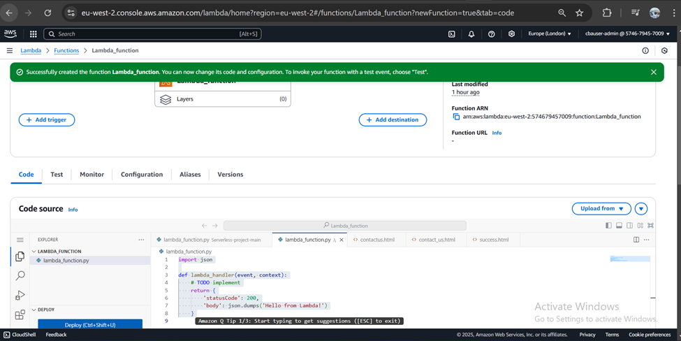
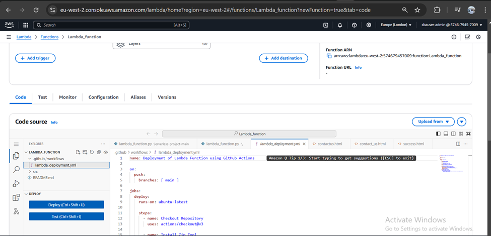
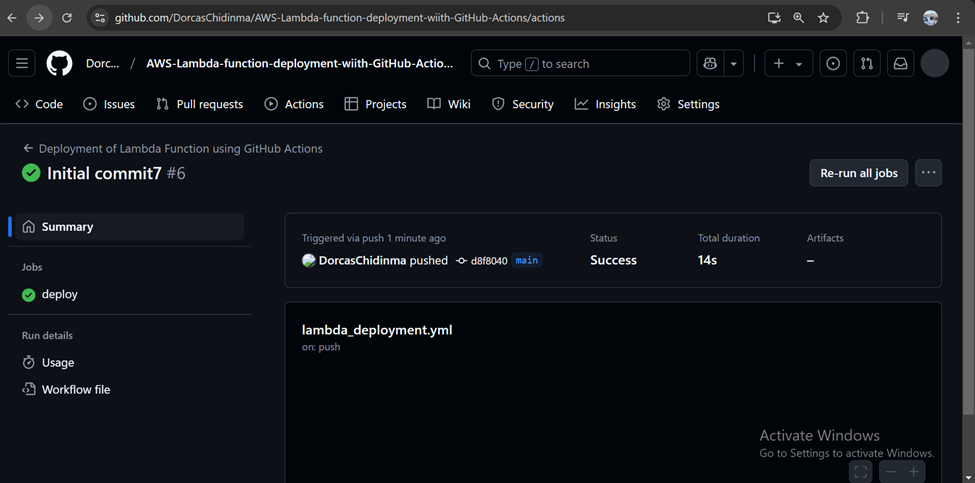

# AWS-Lambda-function-deployment-wiith-GitHub-Actions
Deploy AWS Lambda Function using GitHub Actions CICD

# Prerequisites
1. An AWS account 
2. GitHub account 
3. IDE e.g VSCode

# Step 1
Create a new repository on GitHub and clone the repository on VSCode using the git clone 
git clone https://github.com/DorcasChidinma/AWS-Lambda-function-deployment-wiith-GitHub-Actions.git

# Step 2
Create a Lambda function, runtime is Python 3.11

# Step 3
Go to VSCode, create a folder called src and create a file called lambda_functions.py

Copy the function ARN

arn:aws:lambda:eu-west-2:574679457009:function:Lambda_function

Push the code to GitHub

# Step 4
Create GitHub actions yaml file. Create a .github/workflows folder and create a lambda.deployment file to place the lambda deployment function. Input your repository secrets on GitHub.

mkdir github/workflows
touch lambda.deployment.yml

Push the code to GitHub

